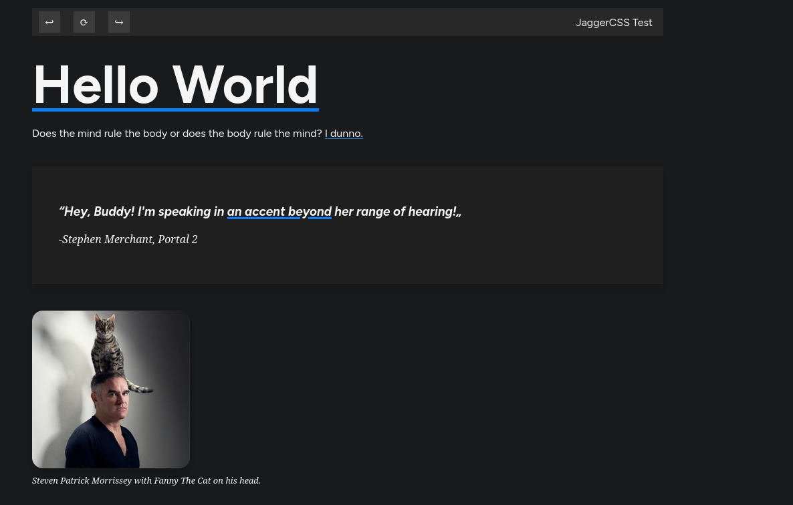

# JaggerCSS

CSS Library (primarily for personal use) named after myself!

View example [here!](https://j-jagger.github.io/JaggerCSS/)

Most of the stylistic brownie points come from the usage of Figtree and @import'd 'Serifics', but I think it looks really nice, and is, sort of, responsive, to say it's only ~300 lines (uncompressed, not including Google Fonts import). 

To Do:
- Post release with proper compression / webpacking
- Clean up classes
- Deploy example.html to a Github Pages instance
- Finish documentation-and-such.html
- Write a basic documentation (the afforementioned is a fake doc mockup page.)
- Redo my personal site using this!

A cool thing is that it's locked to 1024 width, so it resembles the old internet type feel, while maintaining easy readability.

